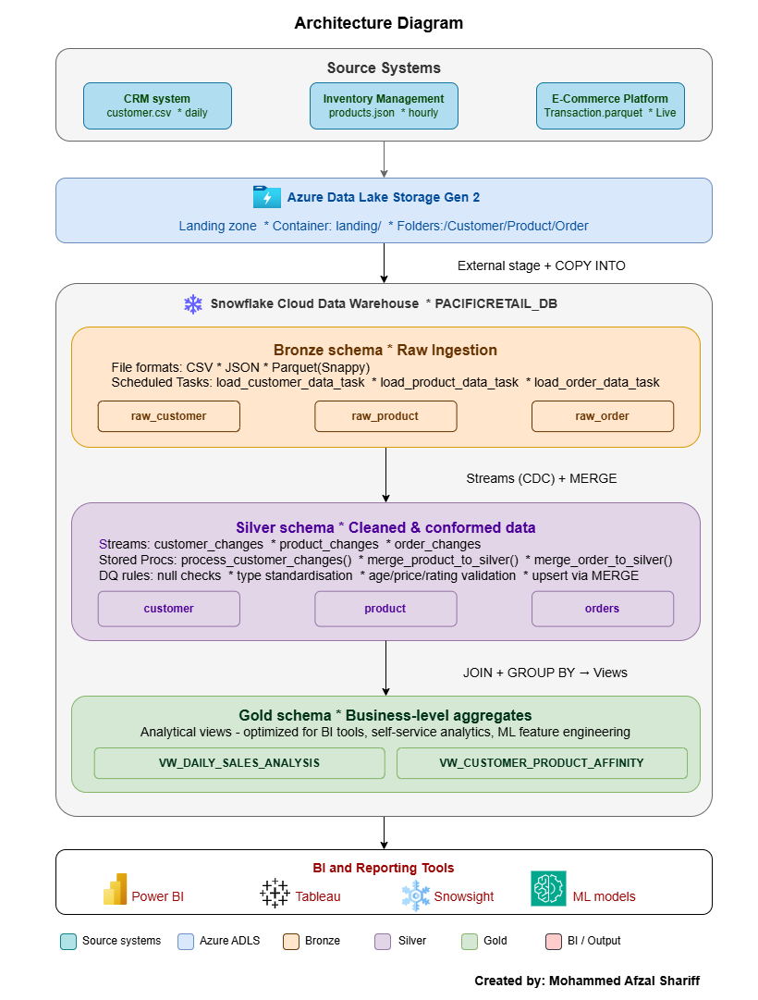

# 🏪 05 — PacificRetail: End-to-End Data Engineering with Snowflake

> **A real-world data engineering project** implementing a full Medallion Architecture
> (Bronze → Silver → Gold) on Snowflake Cloud Data Warehouse with Azure Data Lake Storage.

---

## 📋 Table of Contents

- [Business Problem](#-business-problem)
- [Implementation Approach](#-implementation-approach)
- [Solution Architecture](#-solution-architecture)
- [Tech Stack](#-tech-stack)
- [Key Snowflake Features Used](#-key-snowflake-features-used)
- [Project Structure](#-project-structure)
- [Data Sources](#-data-sources)
- [Layer-by-Layer Breakdown](#-layer-by-layer-breakdown)
  - [Bronze Layer — Raw Ingestion](#-bronze-layer--raw-ingestion)
  - [Silver Layer — Cleaned & Conformed Data](#-silver-layer--cleaned--conformed-data)
  - [Gold Layer — Business-Level Aggregates](#-gold-layer--business-level-aggregates)
- [Data Quality Rules](#-data-quality-rules)
- [Gold Layer Views](#-gold-layer-views)
- [Pipeline Task Schedule](#-pipeline-task-schedule)
- [Git Integration & Snowflake Workspace](#-git-integration--snowflake-workspace)
- [Setup & How to Run](#-setup--how-to-run)
- [Results & Outcomes](#-results--outcomes)
- [Author](#-author)

---

## 🔍 Business Problem

**PacificRetail** is a fast-growing e-commerce company operating across **15 countries** in
North America and Europe, with over **5 million active customers** and a catalogue of
**100,000+ products**.

The company faced critical data challenges that were blocking business growth:

| Challenge | Impact |
|-----------|--------|
| **Data Silos** | Customer, product, and transaction data stored in separate systems — no unified view |
| **Processing Delays** | Batch processing caused 24-hour delays in sales reports |
| **Scalability Issues** | On-premises data warehouse struggled during peak sales periods |
| **Data Quality Problems** | Inconsistent formats and no standardisation across countries |
| **Analytical Limitations** | No support for advanced analytics or ML initiatives |

---

## 🚀 Implementation Approach

### PacificRetail: Multilayer Snowflake Architecture

The solution is built on a **three-layer Medallion Architecture** — a proven industry-standard
pattern for scalable, reliable, and analytics-ready data pipelines.

```
┌─────────────────────────────────────────────────────────────────┐
│                      PACIFICRETAIL_DB                           │
│                                                                 │
│  ┌───────────────┐   ┌───────────────┐   ┌───────────────────┐  │
│  │ BRONZE SCHEMA │ → │ SILVER SCHEMA │ → │   GOLD SCHEMA     │  │
│  │               │   │               │   │                   │  │
│  │ Raw data      │   │ Cleaned &     │   │ Business-level    │  │
│  │ ingestion     │   │ conformed     │   │ aggregates &      │  │
│  │               │   │ data          │   │ analytical views  │  │
│  │ raw_customer  │   │ customer      │   │ VW_DAILY_SALES    │  │
│  │ raw_product   │   │ product       │   │ VW_CUSTOMER       │  │
│  │ raw_order     │   │ orders        │   │   _AFFINITY       │  │
│  └───────────────┘   └───────────────┘   └───────────────────┘  │
└─────────────────────────────────────────────────────────────────┘
```

#### 🥉 Bronze Layer — Raw Data Ingestion
- Lands **all raw data** exactly as received from source systems — no transformation, no cleanup
- Operates in **append-only mode**: every incoming record is preserved for full traceability
- Retains metadata columns (`source_file_name`, `source_file_row_number`, `ingestion_timestamp`)
  for end-to-end lineage tracking
- Three source formats handled: **CSV** (customers), **JSON** (products), **Parquet** (orders)

#### 🥈 Silver Layer — Cleaned and Conformed Data
- Applies **data quality rules and business transformations** to produce a clean, trusted dataset
- Implements **incremental merge logic** using Snowflake Streams (CDC):
  - New records → `INSERT`
  - Existing records → `UPDATE` (upsert via `MERGE` statement)
- Key transformations enforced:
  - Email and transaction ID null filtering
  - Customer type standardisation (`REG / R` → `Regular`, `PREM / P` → `Premium`)
  - Age validation (valid range: 18–120; out-of-range values set to `NULL`)
  - Gender standardisation (`M / MALE` → `Male`, `F / FEMALE` → `Female`, else `Other`)
  - Price and quantity floor validation (negative values set to `0`)
  - Product rating capping (valid range: 0–5; outliers set to `0`)
  - Total purchase amount floor (negative values set to `0`)
- Metadata columns stripped — only clean, business-relevant fields retained

#### 🥇 Gold Layer — Business-Level Aggregates
- Contains **analytical views** built on top of Silver layer tables
- Optimised for **self-service analytics and BI reporting** tools (e.g., Power BI, Tableau)
- Provides **denormalised, query-friendly structures** by joining Customer, Product, and Orders
- Lays the **foundation for ML models** on customer behaviour and demand forecasting
- No raw or intermediate data — Gold is the single source of truth for business consumers

---

## 🏗️ Solution Architecture

```
┌──────────────────────────────────────────────────────────────────────┐
│                        SOURCE SYSTEMS                                │
│   CRM System          Inventory Management     E-Commerce Platform   │
│  (Customer Data)       (Product Catalog)        (Transactions)       │
└──────────┬───────────────────┬──────────────────────────┬────────────┘
           │  Daily CSV        │  Hourly JSON             │  Real-time Parquet
           ▼                   ▼                          ▼
┌──────────────────────────────────────────────────────────────────────┐
│                  AZURE DATA LAKE STORAGE (ADLS Gen2)                 │
│                  Container: landing/                                 │
│         ┌──────────────┬─────────────────┬───────────────┐           │
│         │  /Customer/  │   /Product/     │   /Order/     │           │
│         │  customer.csv│  products.json  │ transaction   │           │
│         │              │                 │ .parquet      │           │
│         └──────────────┴─────────────────┴───────────────┘           │
└──────────────────────────────┬───────────────────────────────────────┘
                               │  External Stage (Storage Integration)
                               ▼
┌──────────────────────────────────────────────────────────────────────┐
│                    SNOWFLAKE CLOUD DATA WAREHOUSE                    │
│                                                                      │
│  ┌──────────────────────────────────────────────────────────────┐    │
│  │  BRONZE SCHEMA  (Raw Ingestion via COPY + Scheduled Tasks)   │    │
│  │   raw_customer │ raw_product │ raw_order                     │    │
│  └────────────────────────┬─────────────────────────────────────┘    │
│                           │  Streams (CDC) + Stored Procedures       │
│                           ▼                                          │
│  ┌──────────────────────────────────────────────────────────────┐    │
│  │  SILVER SCHEMA  (Transformed & Quality-checked via MERGE)    │    │
│  │   customer │ product │ orders                                │    │
│  └────────────────────────┬─────────────────────────────────────┘    │
│                           │  Analytical Views (JOIN + GROUP BY)      │
│                           ▼                                          │
│  ┌──────────────────────────────────────────────────────────────┐    │
│  │  GOLD SCHEMA   (Business-Ready Views for BI & Analytics)     │    │
│  │   VW_DAILY_SALES_ANALYSIS │ VW_CUSTOMER_PRODUCT_AFFINITY     │    │
│  └──────────────────────────────────────────────────────────────┘    │
└──────────────────────────────┬───────────────────────────────────────┘
                               │
                               ▼
            BI Tools  (Power BI / Tableau / Snowsight)
```



---

## 🛠️ Tech Stack

| Component | Technology | Purpose |
|-----------|-----------|---------|
| Cloud Storage | Azure Data Lake Storage Gen2 | Raw file landing zone |
| Data Warehouse | Snowflake | Core processing engine |
| Authentication | Azure Entra ID (Tenant ID) | Secure ADLS-to-Snowflake integration |
| Ingestion | Snowflake External Stage + COPY INTO | Load files from ADLS to Bronze |
| Orchestration | Snowflake Tasks (CRON scheduling) | Automated pipeline execution |
| Change Detection | Snowflake Streams (CDC) | Incremental data capture Bronze → Silver |
| Transformation | Snowflake Stored Procedures (SQL) | Data quality + MERGE logic |
| Serving | Snowflake Views | Gold layer analytical outputs |
| BI / Reporting | Power BI / Tableau (connectable) | Dashboards from Gold views |

---

## ❄️ Key Snowflake Features Used

- Databases & Schemas
- External Stages
- Storage Integrations
- COPY INTO
- File Formats
- Streams (CDC)
- Tasks (Scheduling)
- Stored Procedures
- MERGE Statements
- Analytical Views
- Git Repository Integration
- Snowflake Workspaces

## 📁 Project Structure

```
05-snowflake-retail-data-engineering/
│
├── README.md                             ← This file
│
├── 01_architecture/
│   └── architecture_diagram.png         ← Solution architecture visual
│
├── 02_data/                              ← Sample source data files
│   ├── customer.csv                      ← Customer data (CSV from CRM)
│   ├── products.json                     ← Product catalog (JSON from Inventory)
│   └── transaction.snappy.parquet        ← Orders data (Parquet from E-Commerce)
│
├── 03_sql/
│   ├── 00_git_integration/
│   │   └── git_integration_setup.sql    ← Snowflake Git integration with GitHub repo
│   │
│   ├── 01_setup/
│   │   ├── create_db_and_schemas.sql     ← Database + Bronze/Silver/Gold schemas
│   │   └── external_stage_creation.sql  ← ADLS storage integration + stage
│   │
│   ├── 02_bronze/
│   │   ├── customer_load.sql             ← CSV file format + raw_customer table + task
│   │   ├── product_load.sql              ← JSON file format + raw_product table + task
│   │   └── orders_load.sql               ← Parquet file format + raw_order table + task
│   │
│   ├── 03_silver/
│   │   ├── silver_data_load.sql          ← Silver schema + customer/product/orders tables
│   │   ├── stream_creation.sql           ← CDC streams for all 3 Bronze tables
│   │   ├── customer_transform.sql        ← Stored procedure + task for customer MERGE
│   │   ├── product_transform.sql         ← Stored procedure + task for product MERGE
│   │   └── orders_transform.sql          ← Stored procedure + task for orders MERGE
│   │
│   └── 04_gold/
│       ├── gold_layer.sql                ← Gold schema + manual task execution helpers
│       ├── gold_view1_daily_sales.sql    ← VW_DAILY_SALES_ANALYSIS view
│       └── gold_view2_customer_affinity.sql ← VW_CUSTOMER_PRODUCT_AFFINITY view
│
└── 04_docs/                              ← ← NEW — Project documentation
    └── Azure_Storage_Integration_Setup_Guide.docx
                                          ← End-to-end Azure ADLS setup & troubleshooting guide
```

---

## 📂 Data Sources

| Source System | Format | Frequency | Target Table | Columns |
|--------------|--------|-----------|-------------|---------|
| CRM System | CSV | Daily | `bronze.raw_customer` | customer_id, name, email, country, customer_type, registration_date, age, gender, total_purchases |
| Inventory Management | JSON | Hourly | `bronze.raw_product` | product_id, name, category, brand, price, stock_quantity, rating, is_active |
| E-Commerce Platform | Parquet (Snappy) | Real-time | `bronze.raw_order` | transaction_id, customer_id, product_id, quantity, store_type, total_amount, transaction_date, payment_method |

All Bronze tables additionally carry these **metadata columns** for lineage:
- `source_file_name` — the ADLS file the row was loaded from
- `source_file_row_number` — the row's position in the source file
- `ingestion_timestamp` — the exact time the row was written to Snowflake

---

## 🔬 Layer-by-Layer Breakdown

### 🥉 Bronze Layer — Raw Ingestion

**Objects created:**

| Object | Name | Type | Purpose |
|--------|------|------|---------|
| File Format | `csv_file_format` | FILE FORMAT | Reads CSV with header-skip and null handling |
| File Format | `json_file_format` | FILE FORMAT | Reads JSON with outer array stripping |
| File Format | `parquet_file_format` | FILE FORMAT | Reads Snappy-compressed Parquet |
| Table | `raw_customer` | TABLE | Stores raw customer CSV records |
| Table | `raw_product` | TABLE | Stores raw product JSON records |
| Table | `raw_order` | TABLE | Stores raw order Parquet records |
| Task | `load_customer_data_task` | TASK | Scheduled COPY from ADLS/Customer/ |
| Task | `load_product_data_task` | TASK | Scheduled COPY from ADLS/Product/ |
| Task | `load_order_data_task` | TASK | Scheduled COPY from ADLS/Order/ |

---

### 🥈 Silver Layer — Cleaned & Conformed Data

**Objects created:**

| Object | Name | Type | Purpose |
|--------|------|------|---------|
| Stream | `customer_changes_stream` | STREAM | Captures new rows in `raw_customer` |
| Stream | `product_changes_stream` | STREAM | Captures new rows in `raw_product` |
| Stream | `order_changes_stream` | STREAM | Captures new rows in `raw_order` |
| Table | `silver.customer` | TABLE | Clean, transformed customer data |
| Table | `silver.product` | TABLE | Clean, transformed product data |
| Table | `silver.orders` | TABLE | Clean, validated orders data |
| Procedure | `process_customer_changes()` | STORED PROC | Applies customer DQ rules + MERGE |
| Procedure | `merge_product_to_silver()` | STORED PROC | Applies product DQ rules + MERGE |
| Procedure | `merge_order_to_silver()` | STORED PROC | Filters valid orders + MERGE |
| Task | `silver_customer_merge_task` | TASK | Calls customer stored procedure |
| Task | `product_silver_merge_task` | TASK | Calls product stored procedure |
| Task | `order_silver_merge_task` | TASK | Calls orders stored procedure |

---

### 🥇 Gold Layer — Business-Level Aggregates

**Objects created:**

| Object | Name | Type | Purpose |
|--------|------|------|---------|
| View | `VW_DAILY_SALES_ANALYSIS` | VIEW | Daily sales by product, category, customer type |
| View | `VW_CUSTOMER_PRODUCT_AFFINITY` | VIEW | Customer purchase behaviour by product per month |

---

## ✅ Data Quality Rules

### Customer (Silver)

| Column | Rule | Action |
|--------|------|--------|
| `customer_id` | Must not be NULL | Row excluded from Silver |
| `email` | Must not be NULL | Row excluded from Silver |
| `customer_type` | `REG / R / REGULAR` → `Regular`; `PREM / P / PREMIUM` → `Premium`; else `Unknown` | Standardised |
| `age` | Must be between 18 and 120 | Out-of-range → `NULL` |
| `gender` | `M / MALE` → `Male`; `F / FEMALE` → `Female`; else `Other` | Standardised |
| `total_purchases` | Must not be negative | Negative → `0` |

### Product (Silver)

| Column | Rule | Action |
|--------|------|--------|
| `price` | Must not be negative | Negative → `0` |
| `stock_quantity` | Must not be negative | Negative → `0` |
| `rating` | Must be between 0 and 5 | Out-of-range → `0` |

### Orders (Silver)

| Column | Rule | Action |
|--------|------|--------|
| `transaction_id` | Must not be NULL | Row excluded from Silver |
| `total_amount` | Must be greater than 0 | Row excluded from Silver |

---

## 📊 Gold Layer Views

### View 1 — `VW_DAILY_SALES_ANALYSIS`

Answers: *"What was sold, by whom, at what value — grouped by day?"*

**Columns:** `transaction_date`, `product_id`, `product_name`, `product_category`,
`customer_id`, `customer_type`, `total_quantity`, `total_sales`, `num_transactions`,
`avg_price_per_unit`, `avg_transaction_value`

**Joins:** `silver.orders` → `silver.product` → `silver.customer`

**Use cases:** Daily revenue reporting, product performance dashboards, category-level sales trends

---

### View 2 — `VW_CUSTOMER_PRODUCT_AFFINITY`

Answers: *"Which customers buy which products, how often, and how much do they spend?"*

**Columns:** `customer_id`, `customer_type`, `product_id`, `product_name`,
`product_category`, `purchase_month`, `purchase_count`, `total_quantity`,
`total_spent`, `avg_purchase_amount`, `days_between_first_last_purchase`

**Joins:** `silver.customer` → `silver.orders` → `silver.product`

**Use cases:** Customer segmentation, loyalty analysis, personalised marketing,
ML feature engineering for recommendation models

---

## ⏰ Pipeline Task Schedule

| Task | Layer | Schedule (America/New_York) | Action |
|------|-------|-----------------------------|--------|
| `load_customer_data_task` | Bronze | Daily at 02:00 AM | COPY CSV → `raw_customer` |
| `load_product_data_task` | Bronze | Daily at 03:00 AM | COPY JSON → `raw_product` |
| `load_order_data_task` | Bronze | Daily at 04:00 AM | COPY Parquet → `raw_order` |
| `silver_customer_merge_task` | Silver | Every 4 hours | Call `process_customer_changes()` |
| `product_silver_merge_task` | Silver | Every 4 hrs + 15 min | Call `merge_product_to_silver()` |
| `order_silver_merge_task` | Silver | Every 2 hours | Call `merge_order_to_silver()` |

> **Note:** Tasks are created in `SUSPENDED` state by default. Each task must be activated
> with `ALTER TASK <name> RESUME;` before it will execute on schedule.
> For immediate testing, use: `EXECUTE TASK <task_name>;`

---

## 🔗 Git Integration & Snowflake Workspace

This project includes native Snowflake Git integration with GitHub, enabling:

- Version-controlled SQL development directly inside Snowflake
- Snowflake Workspaces for cloud-native development
- Secure GitHub authentication via API Integration + Secret
- Enterprise-style GitOps workflow
- Future Streamlit app deployment compatibility

**Git Integration Setup File:**
`03_sql/00_git_integration/git_integration_setup.sql`


## ⚙️ Setup & How to Run

### Prerequisites

- Snowflake account (free trial at [snowflake.com](https://www.snowflake.com))
- Azure subscription with Storage Account creation rights
- Azure Entra ID (AAD) Tenant ID

> 📄 For a detailed walkthrough of the Azure ADLS storage integration setup — including
> troubleshooting the service principal IAM assignment — see:
> [`04_docs/Azure_Storage_Integration_Setup_Guide.docx`](04_docs/Azure_Storage_Integration_Setup_Guide.docx)

### Step-by-Step Execution Order

```sql
-- ── STEP 0: Git Integration Setup ──────────────────────────────
-- Run: 03_sql/00_git_integration/git_integration_setup.sql
-- Creates: Snowflake Git integration linked to this GitHub repo
-- Enables: version-controlled SQL development directly in Snowflake

-- ── STEP 1: Database & Schema Setup ────────────────────────────
-- Run: 03_sql/01_setup/create_db_and_schemas.sql
-- Creates: PACIFICRETAIL_DB + BRONZE, SILVER, GOLD schemas

-- ── STEP 2: External Stage (ADLS Connection) ───────────────────
-- Run: 03_sql/01_setup/external_stage_creation.sql
-- Replace: 'Tenant_ID' with your Azure Tenant ID
-- Replace: 'pacificretailstg' with your ADLS account name
-- Replace: '<container_name>' with your container name
-- Action: Grant Storage Blob Data Contributor role to the
--         Snowflake multi-tenant app in Azure IAM
-- 📄 See: 04_docs/Azure_Storage_Integration_Setup_Guide.docx

-- ── STEP 3: Bronze Layer ───────────────────────────────────────
-- Run in order:
--   03_sql/02_bronze/customer_load.sql   → CSV format + raw_customer table + task
--   03_sql/02_bronze/product_load.sql    → JSON format + raw_product table + task
--   03_sql/02_bronze/orders_load.sql     → Parquet format + raw_order table + task

-- ── STEP 4: Silver Layer ───────────────────────────────────────
-- Run in order:
--   03_sql/03_silver/silver_data_load.sql       → Silver tables
--   03_sql/03_silver/stream_creation.sql        → CDC streams
--   03_sql/03_silver/customer_transform.sql     → Stored proc + task
--   03_sql/03_silver/product_transform.sql      → Stored proc + task
--   03_sql/03_silver/orders_transform.sql       → Stored proc + task

-- ── STEP 5: Gold Layer ─────────────────────────────────────────
-- Run in order:
--   03_sql/04_gold/gold_view1_daily_sales.sql
--   03_sql/04_gold/gold_view2_customer_affinity.sql

-- ── STEP 6: Trigger Pipeline Manually for Testing ──────────────
EXECUTE TASK PACIFICRETAIL_DB.BRONZE.LOAD_CUSTOMER_DATA_TASK;
EXECUTE TASK PACIFICRETAIL_DB.BRONZE.LOAD_PRODUCT_DATA_TASK;
EXECUTE TASK PACIFICRETAIL_DB.BRONZE.LOAD_ORDER_DATA_TASK;

EXECUTE TASK PACIFICRETAIL_DB.SILVER.SILVER_CUSTOMER_MERGE_TASK;
EXECUTE TASK PACIFICRETAIL_DB.SILVER.PRODUCT_SILVER_MERGE_TASK;
EXECUTE TASK PACIFICRETAIL_DB.SILVER.ORDER_SILVER_MERGE_TASK;

-- ── STEP 7: Validate Gold Output ───────────────────────────────
SELECT * FROM PACIFICRETAIL_DB.GOLD.VW_DAILY_SALES_ANALYSIS LIMIT 20;
SELECT * FROM PACIFICRETAIL_DB.GOLD.VW_CUSTOMER_PRODUCT_AFFINITY LIMIT 20;
```

---

## 📈 Results & Outcomes

| Metric | Before | After |
|--------|--------|-------|
| Data processing time | 24 hours | Near real-time (≤ 1 hour) |
| Cross-channel sales reporting accuracy | Inconsistent | 99% standardised |
| Scalability | On-premises, limited | Cloud-native, auto-scalable |
| Data quality enforcement | None | Automated at Silver layer |
| Self-service analytics | Not supported | Gold views ready for BI tools |
| ML readiness | Not possible | Gold views usable as feature sets |

---

## 👤 Author

**Mohammed Afzal Shariff (Afzal)**  
Business Intelligence Associate Manager — Accenture Solutions, Bengaluru  
Microsoft Certified: Power Platform Solution Architect Expert | Power BI Data Analyst | Azure Fundamentals

*Expanding expertise in: Snowflake · Azure Data Engineering · Python · Databricks · Machine Learning*

[](https://www.linkedin.com/in/mohammed-afzal-shariff/)
[](https://github.com/afzalshariff07)

---

*Built as part of the LinkedIn Learning course:
[End-to-End Real-World Data Engineering Project with Snowflake](https://www.linkedin.com/learning/end-to-end-real-world-data-engineering-project-with-snowflake)
by Deepak Goyal*
